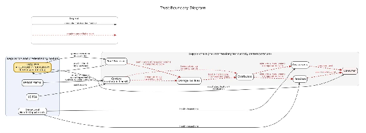
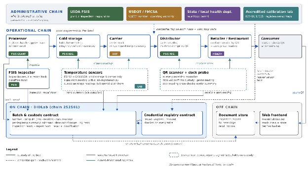

# Chuck and Verify — Checkpoint Report

Cumulative report, maintained across the semester. Sections appear as they become relevant and are then maintained for the rest of the semester. A PDF snapshot of this file is submitted at each checkpoint.

| Checkpoint | Deadline | Question |
| :--- | :--- | :--- |
| **1 — Foundation** | Sunday, October 4, 2026 | Is this project real, and can this team ship? |
| 2 — On Chain | Sunday, October 18, 2026 | Does it actually touch the blockchain? |
| 3 — Functional | Sunday, November 8, 2026 | Can someone who is not on your team actually use it? |
| 4 — Release Candidate | Sunday, November 29, 2026 | Is it finished? |

---

## 1. Project identity — name, team, roles, domain, repository

| | |
| :--- | :--- |
| **Project Name** | Chuck and Verify |
| **Project Team** | Team BB |
| **Team Members** | Britt Huffman ([@brittshanklin](https://github.com/brittshanklin)) Bhavana Sriharika Kondapalli ([@bhavana-sriharika-kondapalli](https://github.com/bhavana-sriharika-kondapalli)) |
| **Domain** | <https://teambb.didlab.org/frontend/index.html> |
| **Repository** | <https://github.com/teambb-blockchain/chuck-and-verify> |

## 2. Problem, stakeholders, and trust boundaries

### Problem

Beef passes through several stages and organizations before it reaches the consumer. During this process, distributors, retailers, restaurants, and consumers depend on inspection records to confirm that the meat has been properly inspected and is safe for consumption. A major concern is that inspection records can be altered, forged, or falsely claimed, making it difficult to confirm whether the information is genuine. In September 2026, FSIS issued a Class I recall due to the false mark of USDA inspection on over 167,000 pounds of meat products (U.S. Department of Agriculture, Food Safety and Inspection Service, 2026). Because of this false mark, retailers and restaurants unknowingly purchased meat with unreliable inspection information to sell to consumers. Another important component of beef safety is temperature during storage and transport. The FSIS issues standards for the safe temperature for beef storage and transport, but adherence to these standards is not independently verifiable by other custodians outside of the time of handoff. When a custodian has possession of the beef, they are both liable and self-reporting on the supply chain status and safety, giving them incentive for falsifying the claims they create and control without options for other parties to verify these claims. These factors can lead to health and safety concerns, financial losses, disruption from product recalls, and overall loss of trust in the beef supply chain by consumers. A method that is tamper-evident and independently verifiable for inspections, custody, and temperature is needed.

> U.S. Department of Agriculture, Food Safety and Inspection Service. (2026, September 22). *Star Meat Delivery Inc. recalls raw pork, beef, and goat products produced without the benefit of inspection*. <https://www.fsis.usda.gov/recalls-alerts/star-meat-delivery-inc--recalls-raw-pork-beef-and-goat-products-produced-without>

### Stakeholders

| Element | Prompt | Our Answer |
| :--- | :--- | :--- |
| **Stakeholders** | Who acts? Name every distinct party — "the hospital" and "the insurer" and "the patient", not "users". | USDA Food Safety and Inspection Service, USDOT Federal Motor Carrier Safety Administration, US FDA, State/Local Health Departments, Beef Processor, Storage Facilities, Distributors, Carriers, Retailers, Restaurants, Consumer |
| **Assets** | What is owned, transferred, claimed, or attested? | **Owned:** The beef batch is owned by the purchaser, and ownership changes with each sale. The temperature report during custody is owned by the custodian. **Transferred:** The beef batch is transferred from sending to receiving custodians. **Claimed:** The beef is claimed to be inspected and safe for consumption. The temperature during custody is claimed to be safe to the other parties by the custodian. **Attested:** The processor is attested by the USDA FSIS by inspection. The carrier's vehicle and driver safety are attested by the USDOT FMCSA. The restaurant is attested by a health inspection report by the State/Local Health Inspectors. |
| **Transactions** | What are the state-changing actions? Who initiates each? | *USDA FSIS* — grant of inspection + revocation of inspection + classification of recalls + recall notifications *USDOT FMCSA* — USDOT numbers + operating authority *US FDA* — audit reports *State/Local Health Departments* — health inspections *Beef Processors* — beef batch registration + mark of inspection + recalls *Storage Facilities* — beef storage + shipping + receipt of shipment *Distributors* — receipt of shipment + splitting batch into smaller lots + distribution *Carriers* — transport of beef to recipient *Retailers* — selling of beef lots + receipt of shipment *Restaurants* — receipt of shipment + preparing for consumption |
| **Records** | What is written down today, by whom, and where does it live? | *USDA FSIS* — grant of inspection records + revocations + pass/fail + recall classifications + notifications (federal government database) *USDOT FMCSA* — USDOT numbers + licenses to operate (federal government database) *US FDA* — audit records + pass/fail (federal government database) *State/Local Health Inspectors* — inspection records + pass/fail (state/local government database, health notices) *Beef Processors* — production and batch records (business database, paper records) *Storage Facilities* — inventory, temperature, orders and deliveries (business database, paper records) *Distributors* — orders, shipping and receiving status, temperature (business database, paper records) *Carriers* — travel logs, arrival times, temperature (business database, paper records) *Retailers* — sales (business database, paper records) *Restaurants* — inventory, menu (business database, paper records) *Consumer* — receipts of purchase |
| **Current Intermediary** | Who sits in the middle today? A company, a registry, a regulator, a spreadsheet someone emails. | USDA FSIS is the intermediary for beef inspection but currently not intermediary across the supply chain for custody and temperature. |
| **What goes wrong** | The concrete failure. Fraud, delay, cost, dispute, loss, capture. | **Fraud:** altered, forged or falsely claimed inspection records; falsified temperature readings **Delay:** access to beef due to recall disruptions **Cost:** financial losses due to misattributed liability or overly broad recalls **Dispute:** liability for beef product loss during recall **Loss:** health and wellbeing of consumers who ingest bad beef; trust in the beef supply chain by consumers |

### Trust boundaries

## 3. Suitability verdict and justification

**Verdict: PROCEED WITH REDESIGN**

A centralized database managed by the USDA is not suitable because it creates a single point of failure both by USDA employees non-maliciously modifying or entering incorrectly or by those who maliciously access the system. It also requires multiple parties across the supply chain to trust the USDA as the authoritative party, in addition to the other parties who provide records. A blockchain solution record cannot be altered once written, either by the USDA or other parties. The transparent lineage the blockchain solution offers also acts as both attribution and deterrence for fraud. Whether to avoid liability, meet quotas, make sales, or avoid reputational damage, the party with the biggest incentive for fraud is the self-reporting party. The operational chain captures the lineage which makes repeated offenses easier to investigate due to the same party showing repeatedly in recalls. The blockchain does not fix the incentive for inaccurate reporting or fraud but adds the administrative chain verifying parties which adds certification to their reporting in the supply chain and a mechanism for their removal for fraud, and the operational chain adds transparency of the certification, lineage, and temperatures. Both in conjunction aims to decrease the ease of malicious fraud and increase the visibility when it occurs repeatedly.

The suitability analysis completed led to three changes to our original design:

- Retail sales data was removed from the chain, so confidential business data is never public (M1-D1). See [decision record 0001](decisions/0001-keep-retail-sales-off-chain.md).
- Inspection and temperature reports stay off chain and are represented on chain only by their hash (M1-Q5).
- A custody handoff is recorded only when the receiving party scans the batch's QR code, instead of the sender reporting it alone (M1-D4).

A third party with no access to any participant's private systems can verify that a beef batch passed USDA inspection, which parties held it and in what quantities, whether safe temperatures have been maintained to FSIS standards during storage and transport, whether temperature readings are consistent across comparisons between the dock and carriers, and whether it has been recalled. This is done by confirming each entry was submitted by an address certified from the administrative chain that is not expired or revoked, by reading temperature and lineage records against the event history and checking inspection and temperature reports against the on-chain hashes on the public chain.

## 4. Architecture — diagram and component description

### Administrative Chain

- **Responsibility:** Certifies who or what can write on the operational chain.
- **Inputs and outputs:** Inputs are requests for credentials, while outputs are issuance, expiry, and revocation of credentials.
- **On-chain or off-chain:** Credential Registry Contract is on-chain, but issuing bodies are off-chain.
- **Who controls it:** USDA FSIS, USDOT FMCSA, State/Local Health Departments and Accredited Calibration Lab (for our simulation we will be acting as the administrative chain and hold the keys to write to the registry).
- **What it guarantees, and what it doesn't:** It guarantees only those with permission at the moment of the write can write on the operational chain, but does not guarantee that the holder has written accurately. It also does not guarantee the issuer is not compromised or hasn't made a mistake, nor that temperature sensors were located as reported.
- **Trust boundary:** This addresses the trust boundary between regulators and credentialing bodies and the supply chain operators.

### Operational Chain

- **Responsibility:** Records what happened to each beef batch from processing to final receipt: batch registration, inspection, custody handoffs, lot splits, temperature summaries, and recalls.
- **Inputs and outputs:** Inputs are writes from credentialed parties: the processor (batch registration, recall initiation), the FSIS inspector (inspection result and report hash, recall classification), each receiving custodian (receipt confirmation and dock reading), the distributor (lot splits by weight), and cold storage and carriers (relayed signed temperature summaries). The output is a timestamped, attributable lineage for each batch that anyone can read.
- **On-chain or off-chain:** The records are on-chain; the parties and their business records are off-chain.
- **Who controls it:** Each credentialed party controls only its own writes and cannot alter another party's records. The consumer reads but cannot write.
- **What it guarantees, and what it doesn't:** It guarantees that each record was written by a party credentialed at the time, cannot be altered afterward, and that custody changes are confirmed by the receiver rather than reported by the sender alone. It does not guarantee the records are accurate. The chain establishes accountability, not accuracy.
- **Trust boundary:** The handoffs between custodians, where custody and temperature claims pass from one party to the next.

### Devices

- **Responsibility:** Capture physical facts such as temperature during storage and transport, and custody confirmation at each handoff.
- **Inputs and outputs:** Inputs are temperature readings from the temperature sensors, QR codes for the QR scanner. Outputs are signed temperature readings, summarized per leg as min/max, time out of range, and a log hash and dock reading for the temperature scanner and receipt confirmation for the QR scanner.
- **On-chain or off-chain:** The devices are off-chain but their outputs are written on-chain by the custodian or receiver.
- **Who controls it:** Custodians operate the devices. Sensor keys are registered by the accredited calibration lab, so a custodian can relay readings but cannot alter them without breaking the signature.
- **What it guarantees, and what it doesn't:** It guarantees that a reading came from a registered sensor and was not changed after signing, and that the receiver, not the sender, confirmed custody. However, it does not guarantee the sensor was physically with the beef, that the custodian relayed every reading rather than withholding readings, or that the QR scanner was used correctly.
- **Trust boundary:** Where physical conditions become digital records controlled by the custodian.

## 5. On-chain / off-chain data decisions

| Element | On chain | Off chain | Justification |
| :--- | :--- | :--- | :--- |
| Production and batch records (processors) | Stakeholder, Batch #, lbs, processing date, date left facility | Business operations details — employee IDs, processes used, pricing | Recording the batch information on-chain creates the starting point for tracking the beef throughout the supply chain. The batch number identifies the product, while the weight helps track the quantity as the batch moves between parties or is divided into smaller lots. The processing and departure dates provide timestamped information for the batch's history. Employee IDs, processing methods, and pricing remain off-chain because they are internal business information and are not necessary to verify the batch's lineage. |
| Inspection records (USDA) | Certification of inspection, grade, date of inspection, hash of the inspection report | Full inspection report, detailed inspection information, certifier details | Recording the inspection result, grade, and date on-chain gives supply-chain participants a reliable way to check the batch's recorded inspection history. These fields show whether an inspection was completed, the quality grade assigned to the batch, and when the inspection took place. The complete inspection report and supporting details remain off-chain because they are not necessary for tracing the batch and would add unnecessary data to the blockchain. Instead, a hash of the report is stored on-chain, allowing the original document to be checked later to determine whether it has been changed. |
| Supply chain records / transport records (logistic partners) | Activity records — stakeholder, date received, date delivered to next partner, lbs | Truck numbers, employee IDs, detailed shipment information, internal logistics records | The transport records provide a timestamped history of the beef batch as it moves through the supply chain. Recording the stakeholder, transfer dates, and weight helps trace when the batch changes custody and how much beef is transferred or separated into smaller lots at each stage. This creates a clear record of the batch's movement and quantity throughout its journey. Detailed information such as truck numbers, employee IDs, and shipment records remains off-chain because it is supporting operational information and is not necessary for verifying the batch's transportation and custody history. |
| Custody scans (receiving party) | Batch #, scanning party, time of scan | Scan images, device logs, station details | The custody scan records that the receiving party confirmed possession of the batch at a specific time. The receiver scans the batch's QR code to confirm the handoff, preventing the sender from recording a completed delivery without confirmation from the other party. This creates a traceable custody transition as the beef moves through the supply chain. Scan images, device logs, and station details remain off-chain because they are operational information and are not necessary for verifying the recorded handoff. |
| Temperature monitoring (sensors) | Batch #, temperature summary, minimum/maximum temperature, time out of range, timestamp, hash of temperature log | Complete sensor readings, detailed temperature logs, device records | Temperature sensors continuously monitor the beef as it moves through processing, storage, transportation, and later stages of the supply chain. Real-time readings help identify when a batch moves outside the required temperature range and allow that condition to be associated with the batch and time it occurred. Because continuous sensor monitoring can produce a large amount of data, the complete temperature readings remain off-chain. Important temperature summaries, exceptions, timestamps, and a hash of the detailed temperature record are stored on-chain. This provides a traceable record of the batch's handling conditions while allowing the detailed sensor data to be verified later to determine whether the sensor records have been modified. |
| Retail records (retailers) | Activity records — stakeholder, date received, lbs received | Individual sales, daily sales volumes, pricing/dates, business operation details — employee IDs, registers, pricing | Recording the retailer, date received, and quantity on-chain continues the traceable history of the beef batch when it reaches the retail stage. These records show when the retailer received the batch and how much was transferred into its custody. Individual purchases, sales volumes, pricing, employee information, and register data remain off-chain because they contain internal business information and are not necessary for verifying the batch's inspection, custody, or supply-chain history. |
| Recall records (USDA) | Recall #, classification, recall date, hash of the recall notice | Recall reason, source of recall, documents created or referenced in the issue of the recall | Recording the recall number, classification, and date on-chain creates a permanent update to the batch's status when a recall occurs. This allows participants and consumers to identify that the affected batch has been recalled and understand the recorded severity of the recall. Detailed reasons and supporting documents remain off-chain because they contain additional information that does not need to be stored directly on the blockchain. A hash of the recall notice is recorded on-chain so the original notice can later be checked to determine whether it has been modified. |

## 6. Deployment record — contract addresses, deployment transactions, chain 252501

_Due at Checkpoint 2._

## 7. Features completed, with evidence

_Due at Checkpoint 2._

## 8. Testing evidence

_Due at Checkpoint 2._

## 9. Security and privacy review

_Due at Checkpoint 3._

## 10. Performance measurements

_Due at Checkpoint 3._

## 11. AI development record

See also [AI_RECORD.md](../AI_RECORD.md) for the running log.

| Field | Entry |
| :--- | :--- |
| Tools used (or "none") | Claude, ChatGPT |
| What you asked for | **Claude:** critique of our §2 and §3 drafts (as a reviewer, not a writer), fact-checks of regulatory claims, review of our §13 risks, rendering of the trust-boundary and architecture diagrams from our own designs, and first drafts of the §4 component descriptions. **ChatGPT:** research on carriers' food-safety obligations under FDA rules, and review of our §5 on-chain/off-chain decisions against the architecture and checkpoint requirements. |
| What it produced | Feedback and guiding questions on our drafts, regulatory corrections, the two diagrams, draft component descriptions, and suggestions for organizing the on-chain/off-chain table. |
| How you verified it | We wrote §2 and §3 ourselves and revised them using the feedback; §5 started from our own design decisions. Regulatory claims were checked against FSIS, FMCSA, and FDA sources. We checked both diagrams against our design and edited the component descriptions before including them. Design decisions stayed with the team. |
| What it got wrong | Claude wrongly concluded that carriers have no food-safety obligations, went into more regulatory detail than this checkpoint needed, referenced a trust-boundary label we never defined, and scrambled the custody order in its first diagram layout. ChatGPT cited irrelevant links and some of its suggestions conflicted with our scope until we gave it more context. |

## 12. Individual contributions

| Member Name | Number of commits | What they contributed |
| :--- | :--- | :--- |
| Britt Huffman | 10 | Repository setup and project documentation, including the AI usage log and team charter [`4e8bbad`, `d1477ce`]; Hardhat project setup with initial contracts and tests [`549f0c2`] and cleanup of unused files [`0ae73c3`]; decision record 0001 and AI usage log entries [`5b9ff33`, `7d3ce7e`]; static frontend page, entry point, and root redirect [`5cb5fc6`, `a001134`, `c551746`]; rename from project-tbd to chuck-and-verify [`9b14b5b`] |
| Bhavana Sriharika Kondapalli | 6 | README update [`1f90598`]; PROPOSAL.md updates with the on-chain/off-chain data decisions, temperature monitoring, project scope, and success criteria [`77ab72e`, `ec8be94`, `0ca15d1`, `e6edbba`, `dd9623a`] |

Commit counts are from `git shortlog -sn` on `main` as of the graded commit.

## 13. Risks, blockers, and what went wrong

### Risks

| Risk | Impact | Mitigation |
| :--- | :--- | :--- |
| Scope grew in three directions (temperature, real hardware, credential registry) | Week 14 deliverables slip | Build the registry and temperature summaries on simulated inputs first before swapping in hardware once it works. Simulated inputs remain as a demo fallback. |
| Hardware lead time and cost | Late integration | Order this week to receive earlier in the semester and borrow coolers and a Raspberry Pi. |
| QR scanner reliability | Handoffs fail during the demo | Test the scanner on arrival after order and setup; phone cameras are the fallback scanner. |
| DIDLab platform constraints (for example, the required URL path) | Deployment surprises | Run all tests on the local Hardhat network; document platform constraints in the README. |

### Blockers

- Decisions on architecture for administrative chains and file storage.

### What went wrong

- Part A was first written about our design rather than today's system. The stakeholder table and trust-boundary diagram had to be reworked once we read the rubric's "current intermediary" and "unverifiable trust" language, which resulted in significant rework.
- Regulatory research went too deep for this checkpoint. We spent considerable time researching and verifying regulatory standards beyond what is helpful for this assignment.
- An unverified claim initially made it into a draft based on assumptions. We initially assumed that FSIS issues recalls, which turned out to be wrong.

## 14. Plan for the next checkpoint

| # | Deliverable | Owner | Done when |
| :--- | :--- | :--- | :--- |
| 1 | Decision records 0002–0004: temperature in scope, simulated administrative chain, real sensors and scanners | Britt Huffman | Merged to main |
| 2 | CredentialRegistry contract: issuers grant and revoke only their own credential type; `isValid` checks expiry and revocation | Britt Huffman | Tests pass, including revoked and expired cases |
| 3 | Supply-chain contract skeleton: `registerBatch`, `recordInspection`, `recordShipment`, `confirmReceipt`, `recordRecall`, each checking the registry | Bhavana Sriharika Kondapalli | Tests pass for authorized and unauthorized writes |
| 4 | Deploy both contracts to DIDLab | Bhavana Sriharika Kondapalli | Evidence block filled in the report |
| 5 | Order hardware; ESP32 signing feasibility test | Britt Huffman | A signed reading verifies on chain |
| 6 | Update PROPOSAL.md, README, and the A2 stakeholder table to the current scope | Bhavana Sriharika Kondapalli | Merged to main |

## 15. Change log — what changed since the previous checkpoint and why

_Due at Checkpoint 2._
